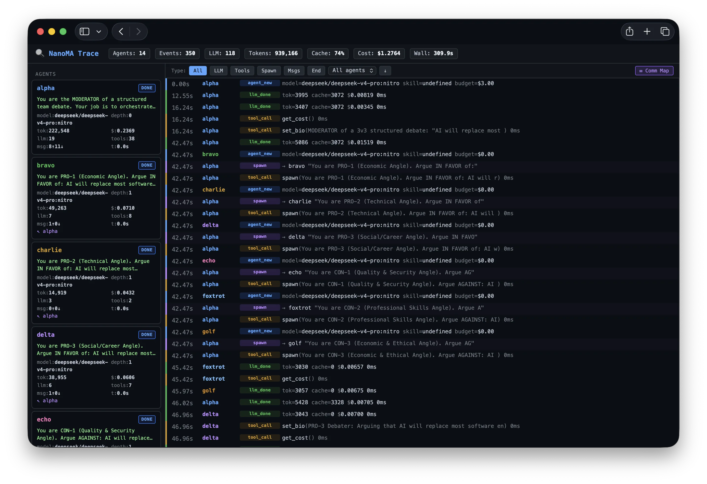
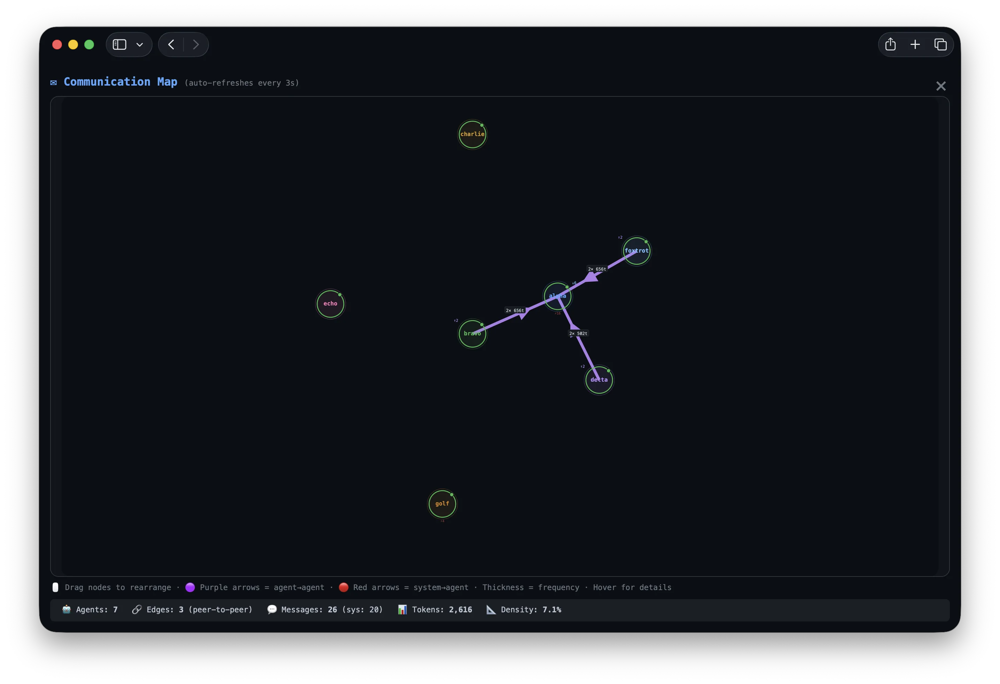

# NanoMA

[](pyproject.toml)

[](LICENSE)

**A minimal multi-agent harness for research.** ~2000 lines of Python.

NanoMA provides the thinnest possible runtime for studying multi-agent LLM coordination.
It is deliberately unopinionated — the framework supplies primitives (spawn, send, wait, kill, shared filesystem),
and the orchestration pattern emerges entirely from the prompt you give the root agent.



## Why

Most MA frameworks bake in a specific paradigm (supervisor-worker, group chat, DAG, etc.).
NanoMA bakes in **nothing** — it provides uniform infrastructure and lets you implement
any topology via prompt engineering alone. This makes it ideal for:

- Researching emergent multi-agent behaviors
- Comparing orchestration patterns under controlled conditions
- Prototyping new coordination strategies without framework code
- Studying how LLMs self-organize given different instructions

## Quick Start

```bash
pip install -e .
export NANOMA_API_KEY="sk-..."
export NANOMA_LLM_BASE_URL="https://openrouter.ai/api/v1"

# Run with a preset orchestration pattern:
nanoma "$(cat presets/01_orchestrator_workers.md | sed 's/{task}/Build a REST API/')" --budget 5.0

# Or run raw — let the agent decide its own strategy:
nanoma "Build a linked list in C with tests" --budget 5.0 --max-agents 20
```

## Design Principles

- **Uniform infrastructure** — every agent has the same loop, same tools. Differentiation emerges from task prompts, not from code.
- **Flat topology** — any agent can message any other. The framework imposes no hierarchy — but agents can self-organize into any pattern.
- **Stigmergy** — agents coordinate through a shared/ filesystem and direct messages.
- **Global budget** — one shared pool. When it runs out, everyone stops.
- **Fresh context** — each spawned agent gets a clean context window.

## Security Notice

NanoMA runs agent shell commands through `codex sandbox` by default. At task
startup it probes that Codex-provided sandbox; if the sandbox command is missing
or unusable, NanoMA refuses to run agent shell commands unsandboxed.

All agents in one run share the same `workspace/`, so they can coordinate
through private workspaces and `shared/` while command execution inherits the
same OS-enforced boundaries that Codex exposes for local commands. Network
access is disabled inside the sandbox unless `sandbox_network=True` or
`--sandbox-network` is set.

The Python host process still holds your LLM API key and performs LLM network
calls. File tools are limited to `workspace_root`, but `--no-sandbox` or
`sandbox_backend="host"` restores the old unsafe behavior where agent shell
commands run directly on the host. For untrusted tasks, still prefer a
disposable VM/container around NanoMA itself.

## Agent Primitives

Every agent has access to:

| Primitive | What it does |
|-----------|-------------|
| `spawn(task, role, create_type, workflow_prior)` | Create a new agent; peer metadata is only injected when `create_type="peer_agent"` |
| `send(to, message, message_type, payload)` | Send plain or structured messages, including `stop_request` |
| `wait(ids, mode)` | Block until agents finish (`mode="all"` or `"any"`) |
| `query()` | Discover all agents, their `action_state`/`state_board`, and `public_memory` |
| `kill(id, emergency=True)` | Emergency-only termination for self/descendants |
| `transfer(src, to)` | Copy files between workspaces |
| `set_status(action=...)` | Update `action_state`, self-stop, or stop with optional `compact_before_stop` |
| `set_bio(bio)` | Advertise your role to others |
| `rebirth(summary)` | Reset context and sync structured memory |
| `compact(summary)` | Compact live history into public summary/experience cards |
| `submit(path)` | Mark a file as deliverable and index it in memory |
| `shell(cmd)` | Execute a shell command |
| `file_read/write/list` | Filesystem operations |
| `grep(pattern)` | Search files |

## Presets (30 Orchestration Patterns)

The `presets/` directory contains 30 prompt templates implementing known MA patterns.
Each is a pure prompt — no code changes needed:

| # | Pattern | Topology |
|---|---------|----------|
| 01 | Orchestrator-Workers | Star |
| 02 | Evaluator-Optimizer | Loop |
| 03 | Prompt Chaining | Chain |
| 04 | Router | Fan-out |
| 05 | Parallelization | Fan-out/in |
| 06 | Debate | Star+Judge |
| 07 | Plan-and-Execute | Planner↔Executor |
| 08 | Map-Reduce | N→1 |
| 09 | Hierarchical Delegation | Tree |
| 10 | Swarm | Mesh |
| 11 | Proposal-Review-Revise | Triangle |
| 12 | Role-Playing Pipeline | Chain+Roles |
| 13 | Mixture of Agents | Layers |
| 14 | Reflection | Self-loop |
| 15 | Round-Robin Group Chat | Ring |
| 16 | Supervisor+Dynamic Routing | Adaptive Star |
| 17 | Handoff Chain | Dynamic Chain |
| 18 | Guardrails | Parallel+Gate |
| 19 | Competitive Tournament | Bracket |
| 20 | Blackboard | Shared Hub |
| 21 | Iterative Deepening | Breadth→Depth |
| 22 | Mediator | Triangle |
| 23 | Watchdog | Monitor |
| 24 | Assembly Line | Fixed Chain |
| 25 | Bidding/Auction | Star→Assign |
| 26 | Consensus | Mesh→Converge |
| 27 | DAG Workflow | DAG |
| 28 | Teacher-Student | Linear |
| 29 | Human-in-the-Loop | Gate |
| 30 | Recursive Decomposition | Dynamic Tree |

Usage: `nanoma "$(cat presets/06_debate.md | sed 's/{task}/your question/')" --budget 2.0`

## Programmatic API

```python
import asyncio
from pathlib import Path
from nanoma import Runtime, RuntimeConfig

async def main():
    config = RuntimeConfig(
        budget=5.0,
        max_agents=20,
        max_turns=50,
        default_model="deepseek/deepseek-v4-flash",
        workspace_root=Path("./workspace"),
        log_dir=Path("./logs"),
        sandbox_backend="codex",
        sandbox_codex_bin="codex",
        sandbox_network=False,
        # Truncation: set any to 0 for unlimited
        shell_max_output=10000,
        file_read_max_chars=50000,
        grep_max_results=100,
    )
    rt = Runtime(config=config)
    result = await rt.run("Your task here")
    print(result)
    print(rt.stats())

asyncio.run(main())
```

## Trace Viewer

Every run produces a trace in `logs/events.jsonl`. View it in real-time:

```bash
python nanoma/viewer.py ./logs 8900
# Open http://localhost:8900
```

Features: event timeline, D3 force-directed communication graph, click-to-inspect LLM calls.
Uses Server-Sent Events (SSE) for live streaming — no stale data.

### Screenshots



## Configuration

```python
RuntimeConfig(
    budget=10.0,              # global budget in USD
    max_agents=1000,          # max total agents
    max_depth=100,            # max spawn depth
    max_concurrent_llm=50,    # parallel LLM calls
    time_limit=0,             # seconds, 0 = unlimited
    max_turns=200,            # per agent
    default_model="deepseek-v4-flash",
    # Shell sandbox
    sandbox_backend="codex",   # codex or host
    sandbox_codex_bin="codex",
    sandbox_network=False,
    # Truncation (0 = unlimited for any of these)
    shell_max_output=10000,
    file_read_max_chars=50000,
    file_list_max_entries=500,
    grep_max_results=100,
    # Context compression
    compress_keep_recent=6,
    compress_max_messages=40,
    compress_max_chars=300,    # 0 = keep full content
)
```

## Citation

If you use NanoMA in your research, please cite:

```bibtex
@software{he2026nanoma,
  author = {Jiyan He},
  title = {NanoMA: A Minimal Multi-Agent Harness for Research},
  year = {2026},
  url = {https://github.com/volltin/NanoMA}
}
```
